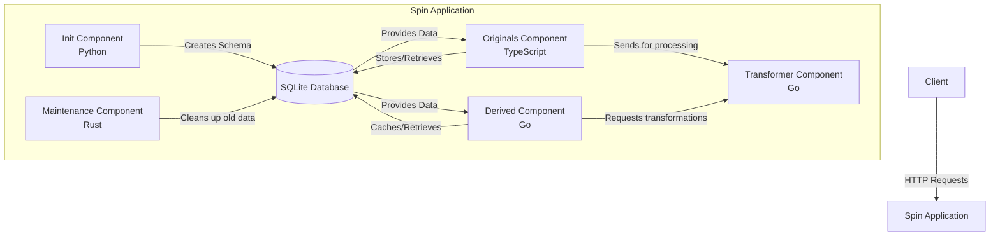

# Image-Repo Spin App Components

The image-repo is a Spin application for image storage and transformation, built with multiple components in different languages. Here's a breakdown of each component, its API, and purpose:

## 1. Init Component (Python)

**Purpose:** Database initialization and schema setup.

**API:**
- `GET /init` - Initializes the SQLite database with required tables

**Implementation Details:**
- Creates two tables:
  - `originals` - Stores original images with name, creation timestamp, and binary data
  - `derived` - Stores transformed versions of original images with foreign key relationships
- Sets up constraints including unique constraints and cascading deletes

## 2. Originals Component (TypeScript)

**Purpose:** Manages original image storage and retrieval.

**API:**
- `GET /originals` - Lists metadata for all original images
- `GET /originals/meta` - Same as above
- `GET /originals/meta/:name` - Gets metadata for a specific image
- `POST /originals/:name` - Uploads a new image with the given name
- `GET /originals/:name` - Retrieves an original image
- `DELETE /originals/:name` - Deletes an image

**Implementation Details:**
- Validates image names (alphanumeric plus `.`, `-`, `_`)
- Prevents use of reserved name "meta"
- Sends uploaded images through the transformer component
- Stores images in SQLite with metadata
- Handles duplicate detection with 409 responses

## 3. Derived Component (Go)

**Purpose:** Manages transformed versions of original images.

**API:**
- `GET /derived/:name` - Retrieves a transformed version of an original image

**Query Parameters:**
- `width` - Target width (1-50000)
- `height` - Target height (1-50000)
- `type` - Output format (`image/png` or `image/jpeg`)

**Implementation Details:**
- Caches transformed images in the database
- Updates last access timestamp on each request
- Calculates transformation string based on parameters
- Fetches from cache if available, otherwise:
  1. Retrieves original image
  2. Sends to transformer component
  3. Stores result in cache
  4. Returns transformed image

## 4. Transformer Component (Go)

**Purpose:** Performs image transformations.

**API:**
- `POST /transform` - Transforms an image according to query parameters

**Query Parameters:**
- `width` - Target width
- `height` - Target height
- `type` - Output format (`image/png` or `image/jpeg`)

**Implementation Details:**
- Supports JPEG and PNG input formats
- Performs image resizing with aspect ratio preservation
- If only width or height is specified, maintains aspect ratio
- Uses the bild library for image transformation
- Returns transformed images in requested format

## 5. Maintenance Component (Rust)

**Purpose:** Performs scheduled cleanup of unused derived images.

**Trigger:**
- CRON job running every 30 seconds (`1/30 * * * * *`)

**Configuration:**
- `max_age_seconds` - Maximum age of derived images before deletion (default: 60 seconds)

**Implementation Details:**
- Connects to the SQLite database
- Calculates the current timestamp
- Deletes all records from the `derived` table where `last_access` is older than the current time minus `max_age_seconds`
- Helps prevent database bloat by removing cached transformations that haven't been accessed recently
- Configurable cleanup interval via the CRON expression in `spin.toml`

## System Architecture

## Data Flow

1. The Init component creates the database schema on first run
2. Clients upload original images via the Originals component
3. When a derived image is requested:
   - The system checks if it's already cached
   - If not, it retrieves the original and sends it to the Transformer
   - The transformed result is cached for future requests
4. All components share the same SQLite database for persistence
5. The Maintenance component periodically cleans up unused derived images to prevent database bloat

## Image Handling

### Supported Image Types
- **Input Formats:** The system supports JPEG and PNG input formats
- **Output Formats:** Transformed images can be delivered as either PNG or JPEG, controlled by the `type` parameter
- **Default Format:** If no output format is specified, PNG is used as the default

### Image Type Autodetection
- The Transformer component automatically detects input image formats using Go's `image.DecodeConfig()` function
- Format detection happens before image decoding, examining the file's binary signature
- If an unsupported format is detected (anything other than JPEG or PNG), an appropriate error is returned